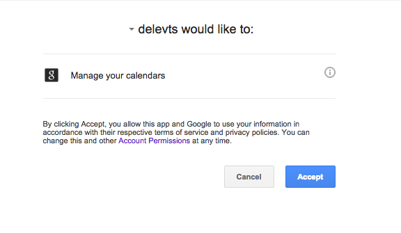
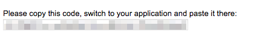

Delevts Google plugin [](https://travis-ci.org/teloo/delevts-plugin-google)
==================

## Installation

This plugin has been installed in [delevts](https://github.com/teloo/delevts).

## Preparation

1. Open [Google Developers Console](https://console.developers.google.com).
2. Create project.
3. Open [APIs & auth] - [Consent screen].
    1. Set [EMAIL ADDRESS] and [PRODUCT NAME].
    2. Click [Save] button.
4. Open [APIs & auth] - [APIs].
    1. Enable Calendar API.
5. Open [APIs & auth] - [Credentials].
    1. Click [Create new Client ID].
    2. Select [Installed application] from [APPLICATION TYPE].
    3. Select [Other] from [INSTALLED APPLICATION TYPE].
6. Display [CLIENT ID] AND [CLIENT SECRET].

## Usage

1. Write the config file.

For example...

```json
{
  "clientId": "<Google OAuth client id>",
  "clientSecret": "<Google OAuth client secret>",
  "calendarId": "<Calendar Id>"
}
```

2. Run this command.

```shell
$ delevts google /path/to/config.json
```

3. Opens the browser.  Accept.



4. Copy the code and input it to console.



5. Displays the refresh token.  Write the config file.

```json
{
  "clientId": "<Google OAuth client id>",
  "clientSecret": "<Google OAuth client secret>",
  "refreshToken": "<Google OAuth refreshToken>",
  "calendarId": "<Calendar Id>"
}
```

Run this command.

```shell
$ delevts google /path/to/config.json
```

## License

See [license](LICENSE) (MIT License).

## Authors

* teloo
